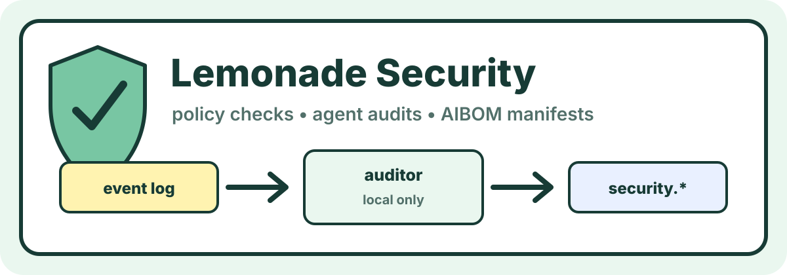

# Lemonade Security

[](pyproject.toml)
[](https://github.com/bong-water-water-bong/lemonade-store)
[](plugins/lemonade-sdk-security)
[](#lemonade-security)
[](#license)

<p align="center">
  
</p>

> Local policy checks, agent audits, AIBOM manifests, and privacy findings for Lemonade Store.

**Lemonade Security** is the `security` department for
[Lemonade Store](https://github.com/bong-water-water-bong/lemonade-store).
It reads store event logs and configuration, then emits `security.*`
events in the shared `store.event.v1` envelope.

This repo starts deliberately small:

- no cloud calls by default
- no customer audio, images, or payment data
- no mutation of cashier, accounting, inventory, supplier, reports,
  site, or marketing events
- owner approval required before exporting reports or sharing findings

## What it does now

```text
store_events.jsonl   ->   auditor   ->   security.audit.completed
                                      ->   security.finding.created
```

The first auditor checks a local event log for basic store policy drift:

- unknown departments
- invalid event envelopes
- approval-gated events that already claim approval at creation time
- cashier core events that appear to involve card, wallet, Stripe, or
  payment gateway data
- customer audio/image storage hints in event payloads

Findings include OWASP-aligned risk IDs from the forked GenAI Security
Project material, including LLM Top 10, Agentic Security Initiative,
and DSGAI data-security taxonomy entries.

## Forked OWASP source material

The local inspection baseline lives in:

```text
/home/bcloud/genai-security-project-forks/
  aibom-generator/
  GenAI-Agent-Security-Initiative/
  GenAI-Data-Security-Initiative/
  GenAI-LLM-Top10/
  GenAI-Red-Team-Lab/
```

Lemonade Security uses those forks as reference material. It does not
vendor their vulnerable samples into the store apps.

## Lemonade SDK plugin boundary

`plugins/lemonade-sdk-security/` is reserved for the Lemonade SDK plugin
surface. The app owns the security policy and event output; the plugin
should only expose that capability to Lemonade SDK hosts. The plugin must
not become a hidden cloud dependency or a way to mutate other department
logs.

## Quick start

```sh
make test

PYTHONPATH=src:../lemonade-store/src python3 -m lemonade_security audit \
  --events tests/fixtures/store_events.jsonl \
  --store-id tie-dye-farms
```

The command prints one JSON event per line. Findings use
`security.finding.created`; the final summary uses
`security.audit.completed`.

## Status

- v0.1 scaffold: local event-log audit only.
- Next: CycloneDX-compatible AIBOM export for local models, tools,
  datasets, department repos, and Lemonade SDK plugin metadata.

## License

MIT.
